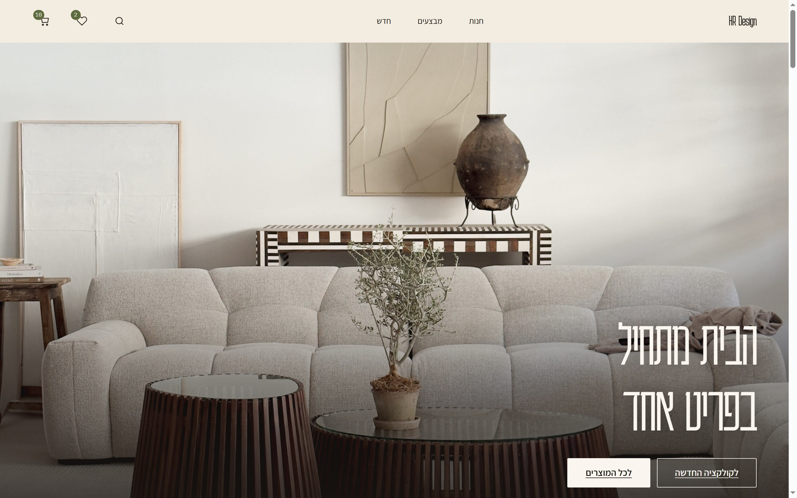
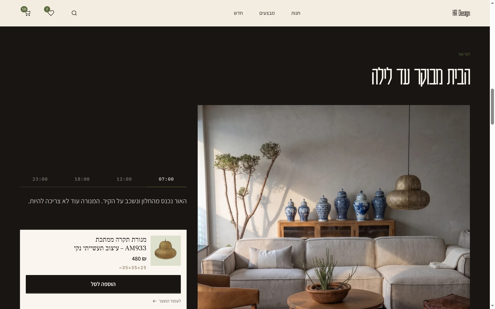
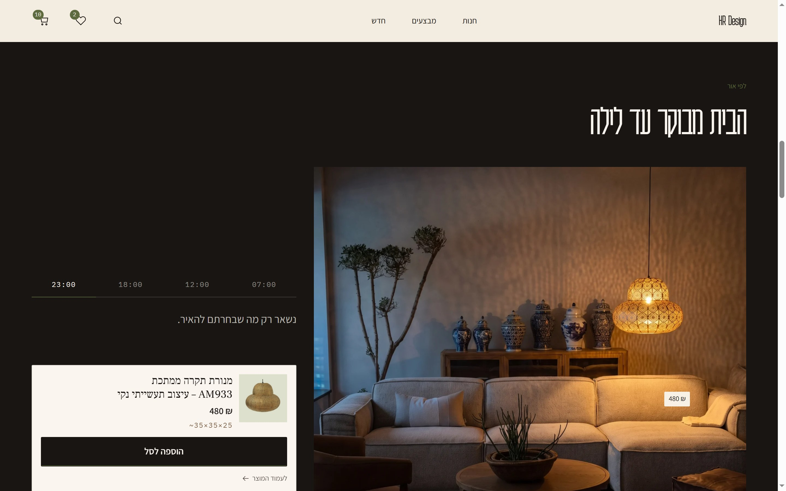
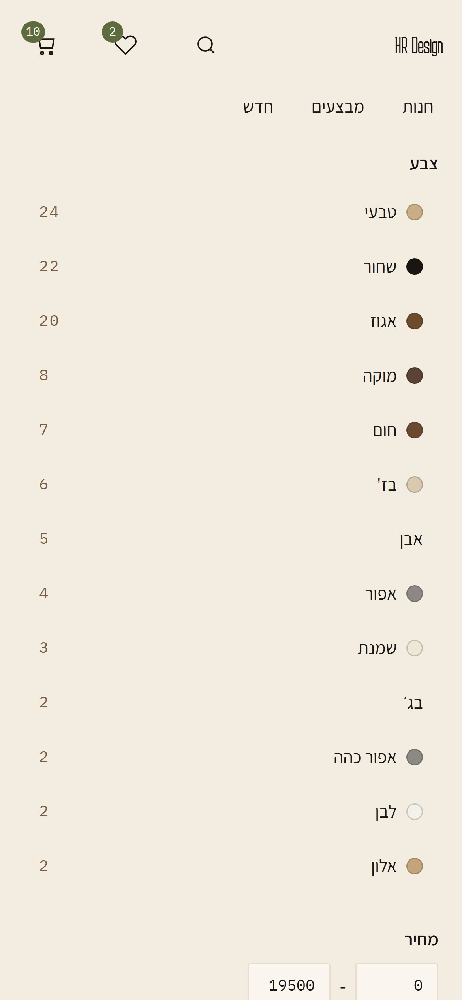
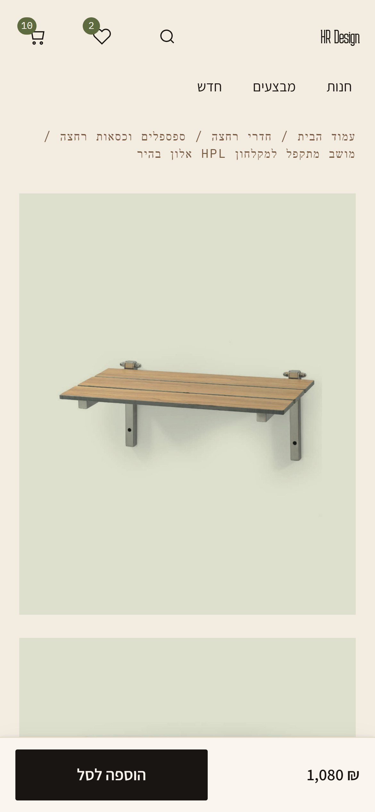
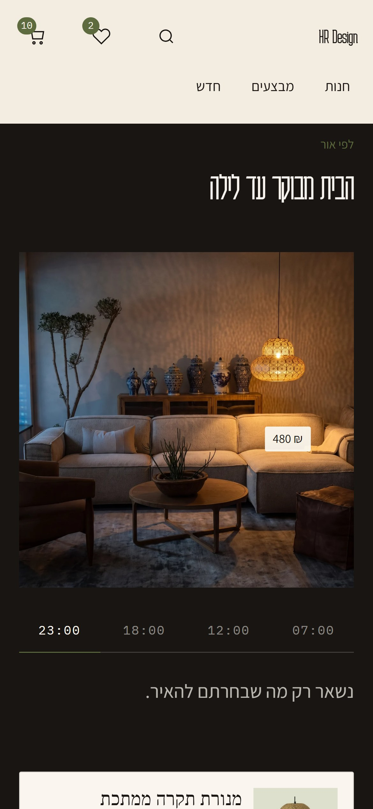

# HR Design — Option 1: "Gallery Apartment"

**This is the first of three separate design directions for hr-design.co.il, each in its
own repository.** They are alternatives, not stages — three different answers to the same
brief, meant to be compared side by side.

| | Direction | Repo |
|---|---|---|
| **1** | **Gallery Apartment** — this one. A custom theme, no framework, 4.3KB of JS. | [`HR-SITE-OP1`](https://github.com/MSA-I/HR-SITE-OP1) |
| 2 | **Animation stack** — the same brief rebuilt full-RTL on a modern animation stack. | [`HR-SITE-OP2`](https://github.com/MSA-I/HR-SITE-OP2) |
| 3 | **Space planner** — a harness for one question: how a 3D space-planner behaves inside the existing page shell. | [`HR-SITE-OP3`](https://github.com/MSA-I/HR-SITE-OP3) |

Option 3 answers a narrower question than 1 and 2 — it is a feature preview against the
current site rather than a whole redesign, so read it alongside them, not against them.

A custom WordPress + WooCommerce theme (Hebrew, RTL) built against 250 of HR Design's
real products, implementing the brief in `הערת ה צ'אט.txt`.

**This is a pitch build.** It is not deployed and never touches the live store.

---

---



*Their own photograph, their own products. Every screenshot in this README is the running
site, not a mockup — including the four generated frames in לפי אור below, which are the
one place the imagery is art-directed rather than documentary. That section says so itself.*

---

## לפי אור — the house from morning to night

The differentiating feature. One living room at four hours, a control that walks its light
from 07:00 to 23:00, and a real pendant from the catalogue that is dark at dawn and is the
only light left at midnight — the only thing in frame still carrying colour, and the only
thing for sale.

| 07:00 | 23:00 |
|---|---|
|  |  |

**It sells the absence of light.** At 07:00 the section tells you that you do not need the
lamp yet. It spends three of its four states saying so, and only asks for money at 23:00.

**The four frames are generated depictions, and that is stated rather than implied.** The
source is HR Design's real living room (product 5932) and their real pendant (6659 / AM933),
fed to an image-to-image model. The furniture is recognisable and the lamp is genuinely
theirs — but the model **re-rendered** the room at each hour rather than relighting their
photograph pixel-for-pixel. These are art direction, not documentary photographs of their
showroom. The exact prompts, and the chaining order that keeps the four frames from drifting, are in [`tools/by-light/`](tools/by-light/).

**Why not grade one photograph in CSS?** That was built first and thrown away. `filter` is a
*global* transform with no spatial information, so imitating light meant hand-placing
gradients — a ten-layer rig faking a falloff it could not compute. A model that actually
lights the room gives real falloff, real bounce, shadows that agree with the geometry, and a
pierced brass shade that throws a genuine caustic pattern across the plaster. The section's
whole mechanism collapsed to cross-fading `opacity` between four ``, which is why
`by-light.css` is short.

**Consistency was the risk, and it was measured, not hoped.** Four independent generations
would drift into four different rooms, and cross-fading between them reads as furniture
morphing rather than as light changing. So night was generated from the source and the other
three from the night render as a geometry anchor. Verified with a block-wise
cross-correlation gate before shipping: **0px drift across the entire room**, and no object
substituted — the five ginger jars are the same five jars in all four frames.

**The control is four native radios and `:has()`. There is no JavaScript in the feature.**
With JS disabled every stop still drives the whole section — proven, not asserted: with page
script execution off, a real click on a label moves the stop, the photograph and the price
chip. The only script is a ~35-line one-shot demo that plays the argument once, rests on
night, and cancels on `pointerdown` / `keydown` / `focusin`. Under reduced motion it never
runs and every change becomes a cut: all of the information, none of the movement.

Square and uncropped means one set of images, no crop, and no separate mobile composition.

| Catalogue | Product page | לפי אור |
|---|---|---|
|  |  |  |

All 14 shots, desktop and mobile, are in [`docs/shots/`](docs/shots/) —
see [`tools/shots/README.md`](tools/shots/README.md) for what each one is for.

---

## The direction

The brief's diagnosis: *"the site works as a shop but doesn't tell a story."* And its
warning: don't build another beige luxury furniture store — that direction is already
generic.

**Gallery Apartment** is the answer this option commits to: a furniture catalogue staged
like a curated apartment-gallery. Hard editorial grid, oversized condensed Hebrew display
type hanging off a right-hand rail, product photos treated as specimens pinned to
coloured planes, and one saturated accent per collection that takes over an entire section
like a painted wall.

It is not beige-generic, and the reason is structural rather than stylistic. Beige-luxury
has a Latin grammar — centred symmetric hero, letterspaced small-caps, blurred ambient
shadows. **Three of those moves are impossible in Hebrew.** There is no uppercase, and
positive tracking on Hebrew destroys word recognition. Sites that copy the template anyway
end up as a Latin skeleton wearing Hebrew, which is exactly why they all look alike and
all look slightly wrong.

So: asymmetric instead of centred. Negative tracking on a condensed Hebrew display face
(Karantina) instead of letterspaced caps. Contact shadows and 1px hairlines instead of
blur. Radius 0, with one arch motif used in exactly one section. Cream is a **ground**,
never a highlight.

---

## Run it

```
docker compose up -d
docker compose exec wpcli wp core install --url=http://localhost:8080 --title="HR Design" \
  --admin_user=admin --admin_password=admin --admin_email=you@example.com --skip-email
docker compose exec wpcli wp language core install he_IL --activate
docker compose exec wpcli wp plugin install woocommerce --activate
docker compose exec wpcli wp theme activate hr-design
docker compose exec wpcli wp rewrite structure '/%postname%/' --hard

npm install
node tools/fonts.mjs            # self-host the webfonts (OFL, fetched not committed)
npm run build

# Seed 250 products from the live Store API. One pass, ~510 polite requests.
node tools/seed/fetch.mjs
docker compose exec wpcli wp eval-file /tools/seed/import.php
docker compose exec wpcli wp eval-file /tools/seed/normalize.php
docker compose exec wpcli wp eval-file /tools/seed/rank.php
docker compose exec wpcli wp eval-file /tools/seed/classify-photos.php
docker compose exec wpcli wp eval-file /tools/seed/import-estimates.php

# לפי אור — the scene, then the four relit frames (WebP, srcset, ~34MB of PNG stays out of git)
docker compose exec wpcli wp eval-file /tools/seed/by-light.php
docker compose exec wpcli wp eval-file /tools/seed/install-bylight.php

# The hero
node tools/scene/fetch-hero.mjs
docker compose exec wpcli wp eval-file /tools/scene/install-hero.php
```

→ http://localhost:8080

**On Windows with a Hebrew path**, probe the bind mount before anything else — it fails
*silently*, mounting an empty directory rather than erroring:

```
docker run --rm -v "D:\משה פרוייקטים\HR_DESIGN-SITE:/x" alpine ls /x
```

---

## What is here

`theme/` is the deliverable — 67 files, ~7,700 lines. Everything else is how it was built.

| | |
|---|---|
| `theme/` | The theme |
| `tools/seed/` | Store API seeder, importer, normaliser, and the analyses that reshaped the plan |
| `tools/scene/` | The hero finder and installer |
| `tools/audit/` | Contrast and bidi audits — see `tools/audit/README.md` |
| `tools/dev-probes/` | In-page diagnostics, loaded as a mu-plugin, never as theme code |
| `tools/shots/` | The capture script — see `tools/shots/README.md` |
| `docs/shots/` | The 14 pitch screenshots |

**`seed/` is not in this repository, deliberately.** It holds 409 of HR Design's product
photographs, their catalogue text, and scene SVGs with their photography embedded as
base64. This repo is public and none of that content is ours. `node tools/seed/fetch.mjs`
reproduces all of it, so nothing is lost.

The screenshots in `docs/shots/` are the exception, and a considered one: they are the
pitch itself, and they show HR Design their own catalogue in a proposed design. That is
the point of sending them. Wholesale republication of the catalogue is not.

---

## Decisions worth defending

**No GSAP, no Lenis, no framework.** The theme's JavaScript is **4.3KB**. ScrollTrigger's
unique value is pinning and scrubbing; both are scroll hijacking, which the brief bans by
name. IntersectionObserver + CSS + cross-document View Transitions cover the whole thing.

The benefits counter is the one number tween on the site and it is 90 lines of
`requestAnimationFrame`, not a dependency. It counts the two figures that have somewhere
to travel and leaves the two ones alone, because a counter from 0 to 1 is a flicker.

**Authored natively RTL.** No `rtl.css`, no build-time flip — the site is Hebrew-only, so it
uses logical properties throughout. Two documented exceptions, both for the same reason: the
dimension diagrams are forced `direction: ltr`, and לפי אור's price chip is positioned with
physical `right`. Their coordinates are positions in an image, and an image does not mirror
when the text does — authored logically, the chip jumped to the far side of the room. That
is not hypothetical; it happened, and the screenshot is how it was caught.

לפי אור also designs the classic RTL trap out of existence rather than handling it: with no
scroll container there is no `scrollLeft`, so the bug documented at `collection.js:13` cannot
occur there at all.

**Progressive enhancement, verified.** Filters are plain links. Add-to-cart is
`?add-to-cart=ID`, intercepted by JS. Both paths were tested with an HTTP client that runs
no JavaScript at all.

**Reduced motion is a data attribute, not a media query.** Set before first paint from
`localStorage ?? the OS preference`. The OS setting is honoured on the first frame, a
footer toggle lets users opt out without touching an OS setting most Israeli Windows users
have never seen, and with JS disabled the attribute is simply absent — so the site renders
static.

---

## Not built, on purpose

- **Reviews with photos** — there are **zero reviews across the entire store**. An empty
  five-star row is the loudest "this is a template" signal there is.
- **AR / "see it in your space"** — needs a 3D model per product. A second project, not a
  feature.

---

## What the data forced

Every row here overturned something in the approved plan. This is the honest record, and
it is the most useful part of this repo for options 2 and 3.

| The plan assumed | Measured reality | What changed |
|---|---|---|
| Content must be scraped | The Store API is public | A paginated fetch, zero npm dependencies |
| 90% of products have parseable dimensions | **3%** for that pattern; 51% across five formats plus native fields | The card's dimension bar was unbuildable as designed |
| Products are shot on white, so `multiply` drops the backdrop | **28% studio, 72% room photographs** | The card branches per photo, measured at import |
| The living room can be composed from their cut-outs | The cut-outs are bathroom fittings and lighting; the one studio sofa is pale-on-white, and multiply erases it | Composing a room from cut-outs was abandoned |
| **HR Design has no living-room photography** — this README's own earlier claim | **False, and it was our own bug.** The seeder capped downloads at 1024px, so the analysis never saw the real assets. `srcset` exposes the true widths: **32 real room photographs at 1400w and above**, living rooms included, up to 2560px | The illustrated room was deleted. לפי אור is built on **an actual photograph** of an actual living room |
| A lamp can be photographed in a room | **No such photograph exists.** All 147 lighting products checked: 25 of 28 sampled are studio cut-outs, and the three room shots are 612w/612w/408w | The room is **relit by a model** at four hours, with the real lamp in it. Compositing the cut-out live in CSS was built first and rejected: it read as a sticker, because `filter` cannot compute light |
| Their photography can carry a full-bleed hero | Median upload **750px**. The styled interiors are 473–750px while the cut-outs reach 3195px — backwards from what design needs | The hero is one of only 44 room photos above 1400w |
| WooCommerce wraps prices in `<bdi>` | It does — and `wp_kses_post()` strips it, because `bdi` is missing from WordPress's allowed tags | `theme/inc/bidi.php`. Without it every price on a Hebrew site is silently mangled. |

---

## Honest limitations

- **LCP was never measured.** A backgrounded automation tab does not paint, so LCP and FCP
  return `null`. Payload is verified: **75KB across 10 requests** on a first visit; theme
  JS 4.3KB, CSS 9KB. The plan's "LCP < 2.5s on throttled 4G" gate is **not** claimed as
  passed.
- **119 of 250 products carry estimated dimensions.** They render with a `~`, a tooltip and
  a screen-reader label, live in `_hrd_dims_estimated`, and never touch WooCommerce's
  native fields. `wp post meta delete --all _hrd_dims_estimated` removes every one.
- **The catalogue is a 250-product sample** of 923.
- **The four לפי אור frames are AI-generated depictions of HR Design's room, not their
  photographs.** The room and the pendant are both real and both theirs, and the source was
  their own photography — but a model re-rendered the scene at each hour rather than
  relighting the original pixel-for-pixel. Geometry was verified to hold across all four
  frames (0px drift, no object substituted) so the cross-fade reads as light rather than as
  morphing furniture, but the pixels are a depiction. Presented as art direction, never as a
  documentary photograph of their showroom. **This reverses the brief's original "real
  photographs, no AI" rule, at the client's own direction.**
- **The four lines of Hebrew copy in לפי אור are ours, not the client's.** They are the
  highest-leverage twenty words in the section and they are still open to his pen; what
  changed is that they now name their own hour, so the line and the stop the reader
  pressed agree, and their lengths vary rather than landing as four sentences of one
  weight.
- **לפי אור is the heaviest section on the site**, and it is a real cost of the above.
  Measured transferred bytes, cache off: **567KB** at desktop 1×, **1.17MB** at desktop 2×,
  **307KB** at mobile 2×, **1.17MB** at mobile 3×. It replaces ~750KB of SVG layers, so it
  is a win at 1× and a loss at retina. Everything is lazy and below the fold, the srcset is
  capped at 1536w, and the frames are WebP encoded once from the lossless source.
